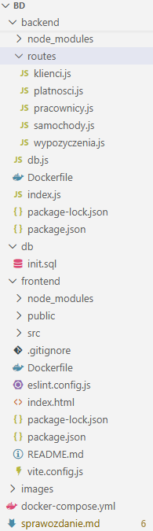
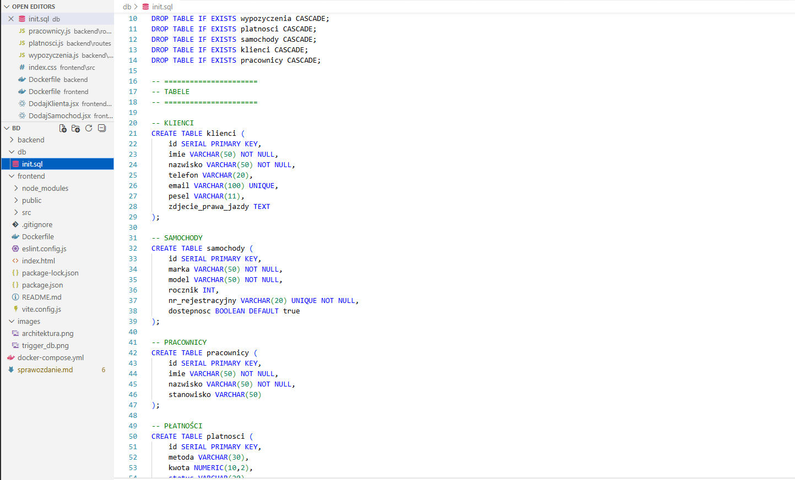
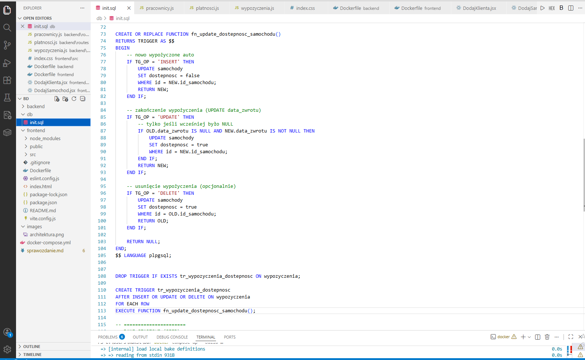
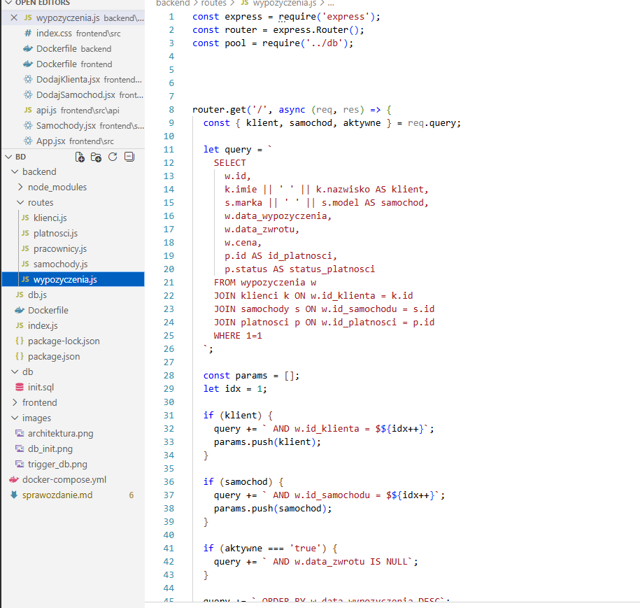
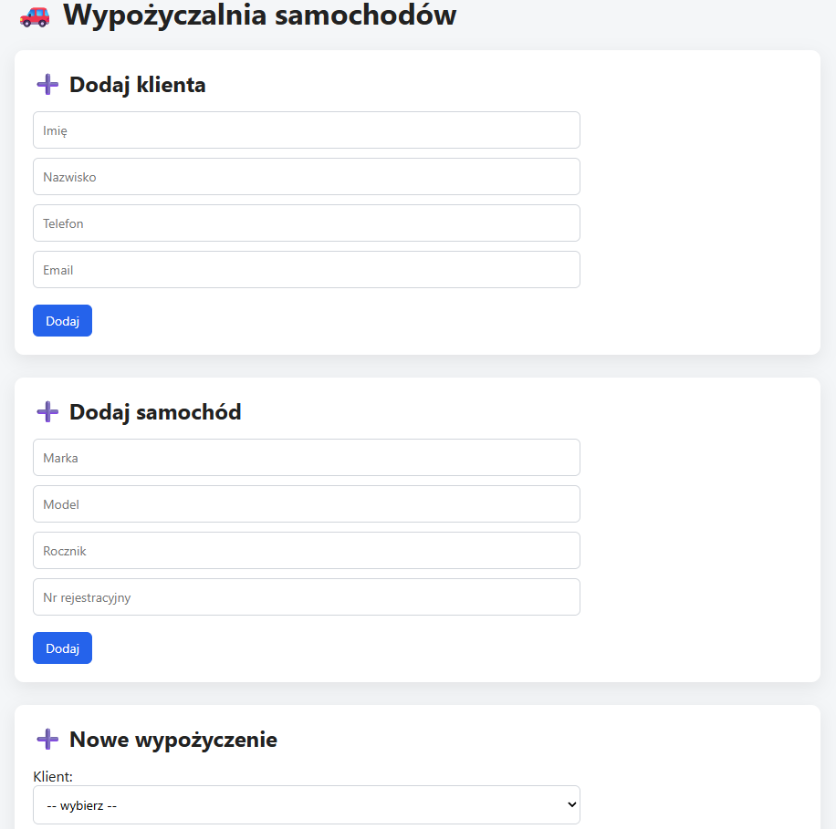
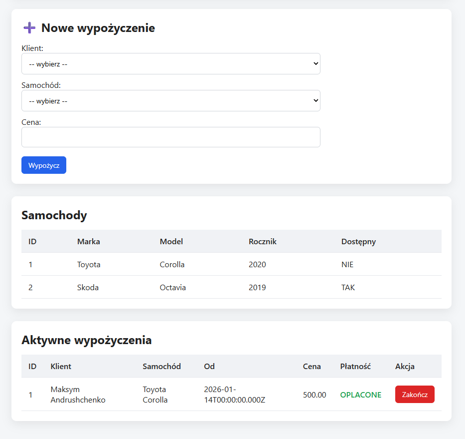
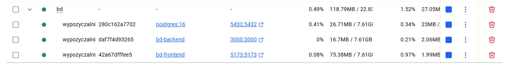

## Projekt: Wypożyczalnia samochodów

**Autor:** Maksym Andrushchenko 

**Numer albumu:** 335980

---

## 1. Cel projektu

Celem projektu było zaprojektowanie i implementacja aplikacji webowej typu **full-stack**, obsługującej proces wypożyczania samochodów.  
System umożliwia zarządzanie klientami, samochodami, wypożyczeniami, płatnościami oraz pracownikami.

Projekt został przygotowany w taki sposób, aby mógł być uruchamiany w środowisku kontenerowym Docker.

---

## 2. Wykorzystane technologie

W projekcie wykorzystano następujące technologie:

- **PostgreSQL 16** – relacyjna baza danych  
- **Node.js + Express** – backend (API REST)  
- **React + Vite** – frontend aplikacji  
- **Docker + Docker Compose** – konteneryzacja  
- **Axios** – komunikacja frontend ↔ backend  

---

## 3. Architektura aplikacji

Aplikacja została podzielona na trzy główne komponenty:

1. **Baza danych (PostgreSQL)**  
2. **Backend (Node.js + Express)**  
3. **Frontend (React)**  

Komponenty są uruchamiane jako osobne kontenery Docker i komunikują się ze sobą w ramach jednej sieci Docker Compose.

### Schemat architektury (opcjonalnie)



---

## 4. Struktura bazy danych

Baza danych składa się z następujących tabel:

- `klienci`
- `samochody`
- `pracownicy`
- `wypozyczenia`
- `platnosci`

Między tabelami zastosowano klucze obce, np.:
- wypożyczenie jest powiązane z klientem i samochodem,

- płatność jest powiązana z wypożyczeniem.

### Przykład definicji tabel (DDL)



---

## 5. Triggery i logika po stronie bazy danych

W projekcie wykorzystano **triggery w PostgreSQL**, które realizują logikę biznesową po stronie bazy danych.

Trigger odpowiada za:
- zmianę statusu samochodu na *niedostępny* po rozpoczęciu wypożyczenia,
- zmianę statusu samochodu na *dostępny* po zakończeniu wypożyczenia.

Dzięki temu spójność danych jest zachowana niezależnie od sposobu modyfikacji danych.

### Kod triggera



---

## 6. Backend – API REST

Backend został zaimplementowany w Node.js z użyciem frameworka Express.  
Udostępnia on API REST umożliwiające wykonywanie operacji CRUD na danych.

Przykładowe endpointy:
- `GET /samochody`
- `POST /wypozyczenia`
- `PUT /wypozyczenia/{id}/zakoncz`
- `POST /platnosci`

### Przykład kodu backendu


Zdjęcie z jednym z endpointów. Inne są bardzo podobne.
---

## 7. Frontend – interfejs użytkownika

Frontend został zaimplementowany przy użyciu biblioteki React.  
Umożliwia on użytkownikowi:

- przeglądanie listy samochodów,
- dodawanie klientów,
- tworzenie wypożyczeń,
- kończenie wypożyczeń,
- obsługę płatności.

Frontend komunikuje się z backendem za pomocą zapytań HTTP (Axios).

### Widok aplikacji

<!-- SCREEN FRONTENDU -->




---

## 8. Konteneryzacja aplikacji

Cała aplikacja została skonteneryzowana przy użyciu **Docker Compose**.  
Projekt można uruchomić jednym poleceniem:

```bash
docker compose up --build
Uruchamiane są trzy kontenery:

PostgreSQL (baza danych),

backend,

frontend.

Docker Desktop – uruchomione kontenery



9. Wnioski końcowe
Projekt pozwolił na praktyczne zastosowanie wiedzy z zakresu: projektowania baz danych, tworzenia aplikacji webowych, architektury klient–serwer, konteneryzacji aplikacji.
Aplikacja spełnia założone wymagania i działa poprawnie w środowisku Docker.

10. Możliwe rozszerzenia projektu
W przyszłości aplikację można rozbudować m.in. o: system logowania użytkowników, role użytkowników (administrator, pracownik), historię wypożyczeń, płatności online, wersję produkcyjną frontendu. Projekt zainspirował też mnie na nowe inne projekty związane z bazami danych. 
